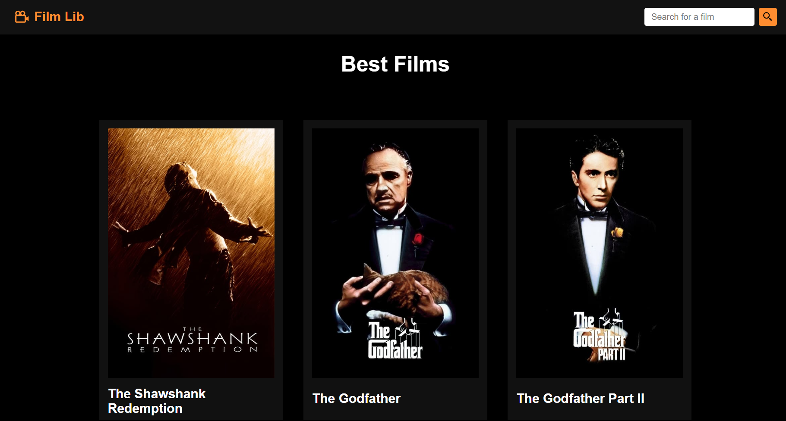

# Film Lib


## Índice

- [Descrição do Projeto](#descrição-do-projeto)
- [Tecnologias Utilizadas](#tecnologias-utilizadas)
- [Executar Projeto](#executar-projeto)

## [Descrição do Projeto](#descrição-do-projeto)

O Film Lib é um projeto que oferece uma listagem e pesquisa de filmes, aproveitando os dados fornecidos pela API The Movie Database.



## [Tecnlogias Utilizadas](#tecnologias-utilizadas)

<div style="display: flex; gap: 15px;">
    <div style="display: flex; flex-direction: column; align-items: center;">

React
</div>

<div style="display: flex; flex-direction: column; align-items: center;">

Javascript
</div>

<div style="display: flex; flex-direction: column; align-items: center;">

CSS
</div>

<div style="display: flex; flex-direction: column; align-items: center;">

Vite
</div>
</div>

## [Executar projeto](#executar-projeto)

### Instalar dependências

```bash
$ npm install
```

### Rodar Localmente

```bash
$ npm run dev
```
